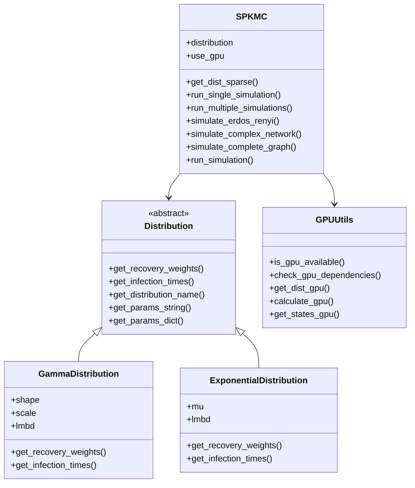
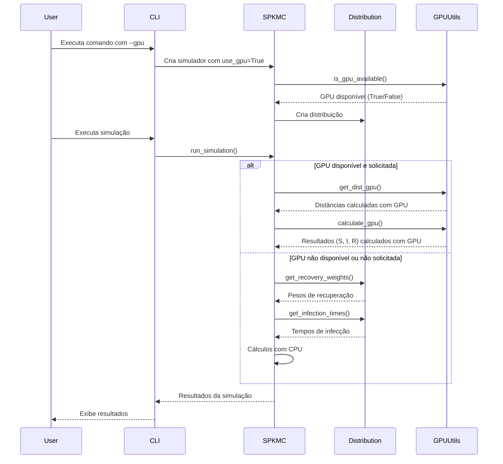

# Plano de Integração da Funcionalidade GPU no SPKMC

Este documento descreve o plano para integrar a funcionalidade GPU ao projeto SPKMC, mantendo a coerência com a arquitetura orientada a objetos existente.

## 1. Visão Geral

### Abordagem Geral

- Integrar a funcionalidade GPU diretamente na classe `SPKMC` existente
- Adicionar um parâmetro `use_gpu` nos métodos relevantes
- Tornar as dependências de GPU opcionais
- Adicionar uma flag `--gpu` global na CLI

### Arquivos a Modificar ou Criar

#### Novos Arquivos:
1. `spkmc/utils/gpu_utils.py` - Funções utilitárias para GPU

#### Arquivos a Modificar:
1. `spkmc/core/simulation.py` - Adicionar suporte a GPU na classe SPKMC
2. `spkmc/cli/commands.py` - Adicionar opção global `--gpu`
3. `setup.py` - Adicionar dependências de GPU como extras opcionais
4. `docs/usage.md` - Documentar o uso da aceleração GPU

## 2. Implementação Detalhada

### 2.1 Módulo de Utilitários GPU

Criar um novo arquivo `spkmc/utils/gpu_utils.py` com o seguinte conteúdo:

```python
def check_gpu_dependencies():
    """
    Verifica se as dependências para GPU estão instaladas.

    Returns:
        bool: True se todas as dependências estão disponíveis, False caso contrário
    """
    try:
        import cupy
        import cudf
        import cugraph
        return True
    except ImportError:
        return False

def is_gpu_available():
    """
    Verifica se a GPU está disponível para uso.

    Returns:
        bool: True se a GPU está disponível, False caso contrário
    """
    if not check_gpu_dependencies():
        return False

    try:
        import cupy as cp
        # Tenta alocar um pequeno array na GPU
        x = cp.array([1, 2, 3])
        return True
    except:
        return False

# Importações condicionais para evitar erros se as dependências não estiverem disponíveis
try:
    import cupy as cp
    import cudf
    import cugraph

    def get_dist_gpu(N, edges, sources, params):
        """
        Calcula as distâncias mínimas dos nós de origem para todos os outros nós usando GPU.

        Args:
            N: Número de nós
            edges: Arestas do grafo como matriz (u, v)
            sources: Nós de origem
            params: Parâmetros da distribuição

        Returns:
            Tupla com (distâncias, tempos de recuperação)
        """
        # Implementação baseada em get_dist_gpu do spkmc_gpu.py
        # 1. Transferência das arestas para GPU
        edges_gpu = cp.asarray(edges, dtype=cp.int32)

        # 2. Amostragem de tempos de recuperação e infecção na GPU
        if params['distribution'] == 'gamma':
            recovery_times = cp.random.gamma(
                params['shape'], params['scale'], size=N
            )
            times = cp.random.gamma(
                params['shape'], params['scale'], size=edges_gpu.shape[0]
            )
        else:
            recovery_times = cp.random.exponential(
                1/params['mu'], size=N
            )
            times = cp.random.exponential(
                params['lambda'], size=edges_gpu.shape[0]
            )

        # 3. Condição de infecção vs. recuperação
        u = edges_gpu[:, 0]
        infection_times = cp.where(times >= recovery_times[u], cp.inf, times)

        # 4. Super-nó para múltiplas fontes
        super_node = N
        super_src = cp.full_like(sources, super_node, dtype=cp.int32)
        dummy_edges = cp.stack([super_src, sources], axis=1)
        dummy_weights = cp.zeros_like(sources, dtype=cp.float32)

        # 5. Concatenação das arestas originais + super-nó
        src = cp.concatenate([edges_gpu[:, 0], dummy_edges[:, 0]])
        dst = cp.concatenate([edges_gpu[:, 1], dummy_edges[:, 1]])
        weight = cp.concatenate([infection_times.astype(cp.float32), dummy_weights])

        # 6. Construção do DataFrame cuDF diretamente na GPU
        df = cudf.DataFrame({'src': src, 'dst': dst, 'weight': weight})

        # 7. Criação do grafo e execução de SSSP em GPU
        G = cugraph.Graph(directed=True)
        G.from_cudf_edgelist(df, source='src', destination='dst', edge_attr='weight')
        result = cugraph.sssp(G, source=super_node, weight='weight')

        # 8. Extração das distâncias de volta ao host
        dist_gpu = result['distance'].to_numpy()[:N]
        return dist_gpu, recovery_times.get()

    def get_states_gpu(time_to_infect, recovery_times, t):
        """
        Calcula os estados (S, I, R) para cada nó em um determinado tempo usando GPU.

        Args:
            time_to_infect: Tempo para infecção de cada nó
            recovery_times: Tempo para recuperação de cada nó
            t: Tempo atual da simulação

        Returns:
            Tupla com arrays booleanos (S, I, R) indicando o estado de cada nó
        """
        S = time_to_infect > t
        I = (~S) & (time_to_infect + recovery_times > t)
        R = (~S) & (~I)
        return S, I, R

    def calculate_gpu(N, time_to_infect, recovery_times, time_steps):
        """
        Calcula a proporção de indivíduos em cada estado (S, I, R) para cada passo de tempo usando GPU.

        Args:
            N: Número de nós
            time_to_infect: Tempo para infecção de cada nó
            recovery_times: Tempo para recuperação de cada nó
            time_steps: Array com os passos de tempo

        Returns:
            Tupla com arrays (S_time, I_time, R_time) contendo a proporção de indivíduos em cada estado
        """
        steps = len(time_steps)
        S_time = cp.zeros(steps)
        I_time = cp.zeros(steps)
        R_time = cp.zeros(steps)

        for idx, t in enumerate(time_steps):
            S, I, R = get_states_gpu(
                cp.asarray(time_to_infect), cp.asarray(recovery_times), t
            )
            S_time[idx] = cp.sum(S) / N
            I_time[idx] = cp.sum(I) / N
            R_time[idx] = cp.sum(R) / N

        return S_time.get(), I_time.get(), R_time.get()

except ImportError:
    # Funções stub para quando as dependências não estão disponíveis
    def get_dist_gpu(N, edges, sources, params):
        raise ImportError("Dependências GPU (cupy-cuda12x, cudf-cu12, cugraph-cu12) não estão instaladas")

    def get_states_gpu(time_to_infect, recovery_times, t):
        raise ImportError("Dependências GPU (cupy-cuda12x) não estão instaladas")

    def calculate_gpu(N, time_to_infect, recovery_times, time_steps):
        raise ImportError("Dependências GPU (cupy-cuda12x) não estão instaladas")
```

### 2.2 Modificação da Classe SPKMC

Modificar o arquivo `spkmc/core/simulation.py` para adicionar suporte a GPU:

```python
import numpy as np
from tqdm import tqdm
from scipy.sparse.csgraph import dijkstra
from scipy.sparse import csr_matrix
import os
from typing import Dict, List, Tuple, Union, Optional, Any, Bool

from spkmc.core.distributions import Distribution
from spkmc.core.networks import NetworkFactory
from spkmc.io.results import ResultManager
from spkmc.utils.numba_utils import calculate
from spkmc.utils.gpu_utils import is_gpu_available, get_dist_gpu, calculate_gpu

class SPKMC:
    """
    Implementação do algoritmo Shortest Path Kinetic Monte Carlo (SPKMC).

    Esta classe implementa o algoritmo SPKMC para simulação de propagação de epidemias
    em redes, utilizando o modelo SIR (Susceptible-Infected-Recovered).
    """

    def __init__(self, distribution: Distribution, use_gpu: bool = False):
        """
        Inicializa o simulador SPKMC.

        Args:
            distribution: Objeto de distribuição a ser usado na simulação
            use_gpu: Se True, usa aceleração GPU (se disponível)
        """
        self.distribution = distribution
        self.use_gpu = use_gpu and is_gpu_available()

        if use_gpu and not is_gpu_available():
            import warnings
            warnings.warn("GPU solicitada, mas não disponível. Usando CPU.")

    def get_dist_sparse(self, N: int, edges: np.ndarray, sources: np.ndarray) -> Tuple[np.ndarray, np.ndarray]:
        """
        Calcula as distâncias mínimas dos nós de origem para todos os outros nós.

        Args:
            N: Número de nós
            edges: Arestas do grafo como matriz (u, v)
            sources: Nós de origem

        Returns:
            Tupla com (distâncias, tempos de recuperação)
        """
        if self.use_gpu:
            # Versão GPU
            params = {
                'distribution': self.distribution.get_distribution_name(),
                'shape': getattr(self.distribution, 'shape', 2.0),
                'scale': getattr(self.distribution, 'scale', 1.0),
                'mu': getattr(self.distribution, 'mu', 1.0),
                'lambda': getattr(self.distribution, 'lmbd', 1.0)
            }
            return get_dist_gpu(N, edges, sources, params)
        else:
            # Versão CPU original
            # Gera os tempos de recuperação
            recovery_weights = self.distribution.get_recovery_weights(N)

            # Calcula os tempos de infecção
            infection_times = self.distribution.get_infection_times(recovery_weights, edges)

            # Cria a matriz esparsa do grafo
            row_indices = edges[:, 0]
            col_indices = edges[:, 1]
            graph_matrix = csr_matrix((infection_times, (row_indices, col_indices)), shape=(N, N))

            # Calcula as distâncias mínimas
            dist_matrix = dijkstra(csgraph=graph_matrix, directed=True, indices=sources, return_predecessors=False)
            dist = np.min(dist_matrix, axis=0)

            return dist, recovery_weights

    def run_single_simulation(self, N: int, edges: np.ndarray, sources: np.ndarray,
                             time_steps: np.ndarray) -> Tuple[np.ndarray, np.ndarray, np.ndarray]:
        """
        Executa uma única simulação SPKMC.

        Args:
            N: Número de nós
            edges: Arestas do grafo como matriz (u, v)
            sources: Nós de origem
            time_steps: Array com os passos de tempo

        Returns:
            Tupla com (S, I, R) contendo a proporção de indivíduos em cada estado
        """
        # Calcula os tempos de infecção e recuperação
        time_to_infect, recovery_times = self.get_dist_sparse(N, edges, sources)

        # Calcula os estados para cada passo de tempo
        if self.use_gpu:
            # Versão GPU
            return calculate_gpu(N, time_to_infect, recovery_times, time_steps)
        else:
            # Versão CPU original
            steps = time_steps.shape[0]
            return calculate(N, time_to_infect, recovery_times, time_steps, steps)

    def run_multiple_simulations(self, G: nx.DiGraph, sources: np.ndarray, time_steps: np.ndarray,
                                samples: int, show_progress: bool = True) -> Tuple[np.ndarray, np.ndarray, np.ndarray]:
        """
        Executa múltiplas simulações SPKMC e retorna a média.

        Args:
            G: Grafo da rede
            sources: Nós de origem
            time_steps: Array com os passos de tempo
            samples: Número de amostras
            show_progress: Se True, mostra barra de progresso

        Returns:
            Tupla com (S_mean, I_mean, R_mean) contendo a média da proporção de indivíduos em cada estado
        """
        steps = time_steps.shape[0]

        S_values = np.zeros((samples, steps))
        I_values = np.zeros((samples, steps))
        R_values = np.zeros((samples, steps))

        edges = np.array(G.edges())
        N = G.number_of_nodes()

        # Configura a barra de progresso
        if show_progress:
            sample_items = tqdm(range(samples), desc="Amostras")
        else:
            sample_items = range(samples)

        # Executa as simulações
        for sample in sample_items:
            S, I, R = self.run_single_simulation(N, edges, sources, time_steps)
            S_values[sample, :] = S
            I_values[sample, :] = I
            R_values[sample, :] = R

        # Calcula as médias
        S_mean = np.mean(S_values, axis=0)
        I_mean = np.mean(I_values, axis=0)
        R_mean = np.mean(R_values, axis=0)

        return S_mean, I_mean, R_mean

    # Os outros métodos permanecem inalterados, pois eles já usam os métodos modificados acima
```

### 2.3 Modificação da CLI

Modificar o arquivo `spkmc/cli/commands.py` para adicionar a opção global `--gpu`:

```python
@click.group(help="CLI para o algoritmo SPKMC (Shortest Path Kinetic Monte Carlo)")
@click.version_option(version="1.0.0")
@click.option("--verbose", "-v", is_flag=True, help="Ativar modo verboso para depuração")
@click.option("--no-color", is_flag=True, help="Desativar cores na saída")
@click.option("--simple", is_flag=True, help="Gerar arquivo de resultado simplificado em CSV (tempo, infectados, erro)")
@click.option("--gpu", is_flag=True, help="Usar aceleração GPU para cálculos (requer CuPy, cuDF e cuGraph)")
def cli(verbose, no_color, simple, gpu):
    """Grupo principal de comandos da CLI SPKMC."""
    # Configura o modo verboso
    os.environ["SPKMC_VERBOSE"] = "1" if verbose else "0"

    # Configura o uso de GPU
    os.environ["SPKMC_USE_GPU"] = "1" if gpu else "0"

    if verbose:
        log_info("Modo verboso ativado")

    if no_color:
        log_info("Cores desativadas na saída")

    if simple:
        log_info("Modo de saída simplificada em CSV ativado")

    if gpu:
        from spkmc.utils.gpu_utils import is_gpu_available
        if is_gpu_available():
            log_info("Aceleração GPU ativada")
        else:
            log_warning("Aceleração GPU solicitada, mas não disponível. Usando CPU.")
```

E modificar o comando `run` para usar a opção GPU:

```python
@cli.command(help="Executar uma simulação SPKMC")
# ... outras opções existentes ...
def run(simple, network_type, dist_type, shape, scale, mu, lambda_val, exponent, nodes, k_avg,
        samples, num_runs, initial_perc, t_max, steps, output, export_format, no_plot,
        save_plot, overwrite, verbose):
    """Executa uma simulação SPKMC com os parâmetros especificados."""
    # ... código existente ...

    # Verificar se a GPU foi solicitada
    use_gpu = os.environ.get("SPKMC_USE_GPU") == "1"

    # Criar a distribuição
    distribution_params = {
        "shape": shape,
        "scale": scale,
        "mu": mu,
        "lambda": lambda_val
    }
    distribution = create_distribution(dist_type, **distribution_params)
    log_debug(f"Distribuição {dist_type.capitalize()} criada com parâmetros: {distribution_params}", verbose_only=True)

    # Criar o simulador com a opção GPU
    simulator = SPKMC(distribution, use_gpu=use_gpu)

    # ... resto do código existente ...
```

Da mesma forma, modificar o comando `batch` para usar a opção GPU:

```python
@cli.command(help="Executar múltiplos cenários de simulação a partir de um arquivo JSON")
# ... outras opções existentes ...
def batch(simple, scenarios_file, output_dir, prefix, compare, no_plot, save_plot, verbose):
    """Executa múltiplos cenários de simulação a partir de um arquivo JSON."""
    # ... código existente ...

    # Verificar se a GPU foi solicitada
    use_gpu = os.environ.get("SPKMC_USE_GPU") == "1"

    # ... código existente ...

    # Para cada cenário
    for i, scenario in enumerate(scenarios):
        # ... código existente ...

        # Criar a distribuição
        distribution = create_distribution(dist_type, **dist_params)

        # Criar o simulador com a opção GPU
        simulator = SPKMC(distribution, use_gpu=use_gpu)

        # ... resto do código existente ...
```

### 2.4 Atualização do Arquivo setup.py

Modificar o arquivo `setup.py` para incluir as dependências de GPU como extras opcionais:

```python
from setuptools import setup, find_packages

setup(
    name="spkmc",
    version="1.0.0",
    packages=find_packages(),
    install_requires=[
        "numpy",
        "scipy",
        "networkx",
        "matplotlib",
        "numba",
        "tqdm",
        "click",
        # outras dependências obrigatórias
    ],
    extras_require={
        "gpu": [
            "cupy-cuda12x",
            "cudf-cu12",
            "cugraph-cu12",
        ],
    },
    # ... outras configurações ...
)
```

### 2.5 Documentação

Atualizar o arquivo `docs/usage.md` para incluir informações sobre a funcionalidade GPU:

```markdown
## Uso da Aceleração GPU

O SPKMC suporta aceleração GPU para melhorar o desempenho das simulações. Para usar a GPU, você precisa ter as seguintes dependências instaladas:

- cupy-cuda12x
- cudf-cu12
- cugraph-cu12

Você pode instalar essas dependências usando:

```bash
pip install -e .[gpu]
```

Para usar a aceleração GPU na linha de comando, adicione a flag `--gpu`:

```bash
python spkmc_cli.py --gpu run --network-type er --dist-type gamma
```

Para usar a aceleração GPU programaticamente:

```python
from spkmc.core.distributions import create_distribution
from spkmc.core.simulation import SPKMC

# Criar a distribuição
distribution = create_distribution("gamma", shape=2.0, scale=1.0)

# Criar o simulador com GPU
simulator = SPKMC(distribution, use_gpu=True)

# Executar a simulação
result = simulator.run_simulation("er", time_steps, N=1000, k_avg=10)
```

Note que se as dependências de GPU não estiverem disponíveis ou se a GPU não puder ser usada, o SPKMC automaticamente recorrerá à implementação CPU.

### Requisitos de Sistema para GPU

Para usar a aceleração GPU, você precisa ter:

1. Uma GPU NVIDIA compatível com CUDA 12
2. Drivers NVIDIA atualizados
3. CUDA Toolkit 12.x instalado
```

## 3. Diagramas

### 3.1 Diagrama de Classes



### 3.2 Fluxo de Execução com GPU



## 4. Considerações Adicionais

### 4.1 Tratamento de Erros

- Verificar a disponibilidade da GPU no início da execução
- Fornecer mensagens de erro claras quando a GPU for solicitada mas não estiver disponível
- Recorrer automaticamente à implementação CPU quando a GPU não estiver disponível

### 4.2 Testes

- Criar testes unitários para as funções GPU
- Criar testes de integração para verificar a compatibilidade entre as implementações CPU e GPU
- Verificar se os resultados das implementações CPU e GPU são consistentes

### 4.3 Desempenho

- Comparar o desempenho das implementações CPU e GPU
- Identificar possíveis gargalos na implementação GPU
- Otimizar a transferência de dados entre CPU e GPU

### 4.4 Compatibilidade

- Garantir que a implementação GPU funcione em diferentes versões do CUDA
- Documentar os requisitos de hardware e software para usar a GPU
- Fornecer instruções claras para instalação das dependências GPU
